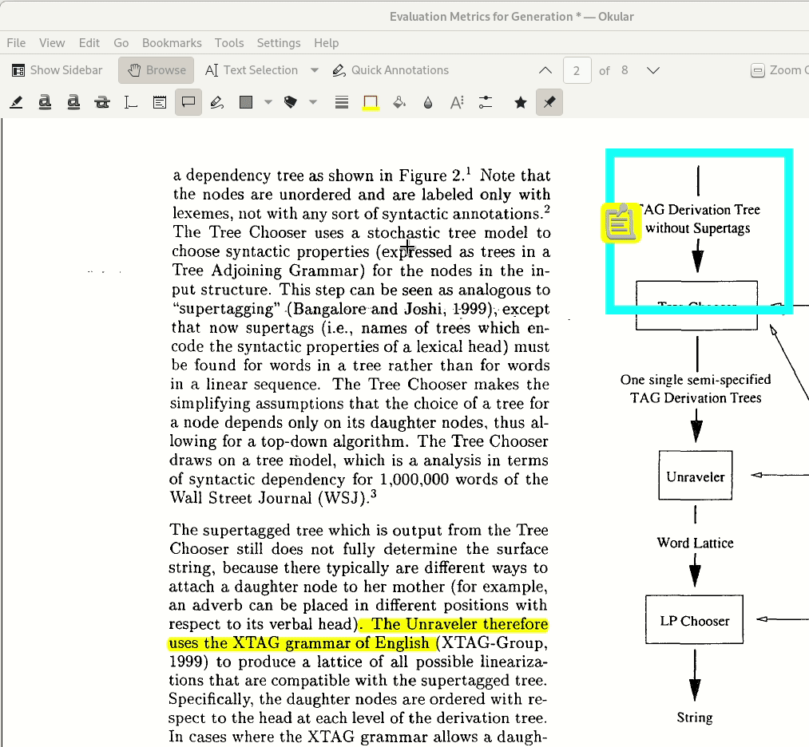
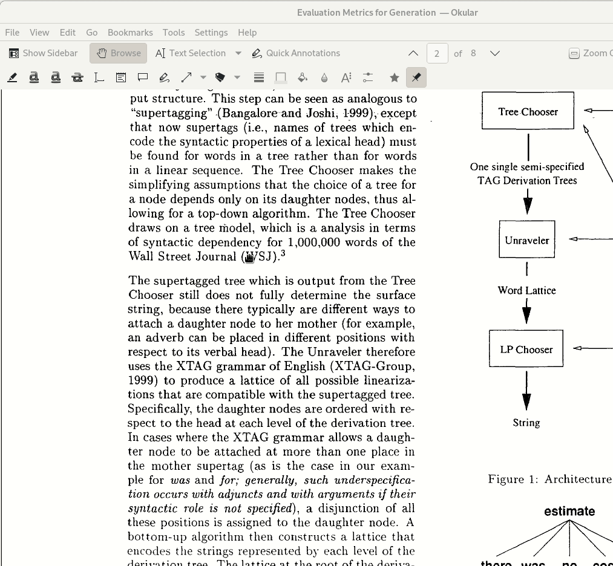
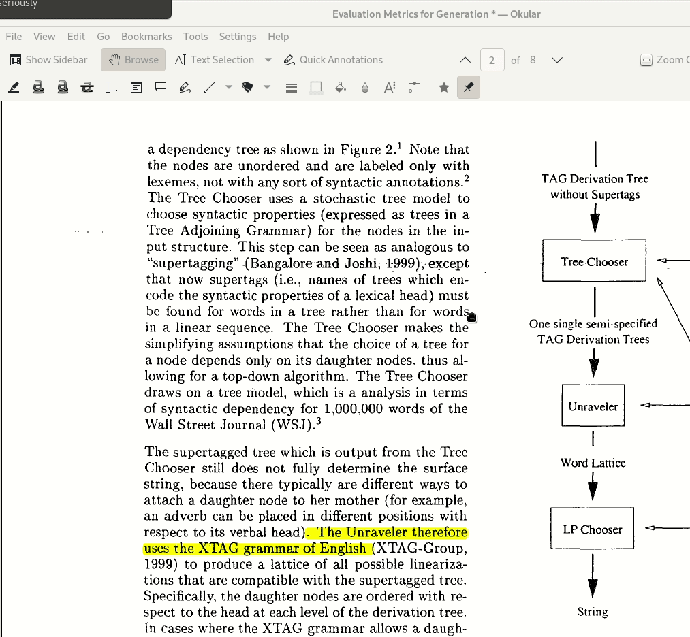
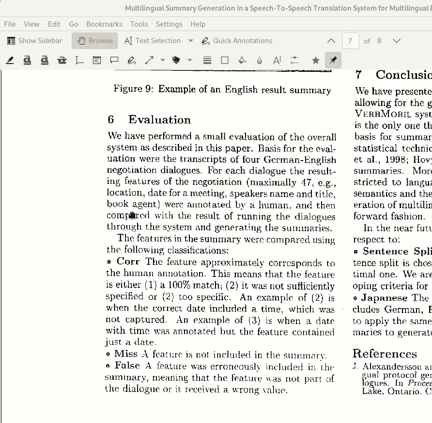

# How to collect evidence by highlighting PDFs

by Dave Howcroft

When we release our analysis and our dataset, we want to include the set of evidence used to make our annotations.
The easiest way to collect this information is by highlighting text and/or regions in the original PDFs.
These instructions show how to do this highlighting and in-PDF evidence labelling and provide some guidance as to what kinds of things to count as evidence.

**NB**: Do not confuse PDF annotation (i.e. labelling the highlighted regions in the PDF) with what we have been calling "annotation" throughout this collaboration (i.e. extracting relevant information about systems and evaluations and documenting it in our spreadsheet). 
I will endeavour to be clear throughout this document in what I mean, but please let me know if something is confusing.

## Annotation Software

Examples in this document will be given for [Okular](https://okular.kde.org/) an open source PDF annotation tool developed for the KDE desktop environment which is also available on Windows and (apparently with some difficulty) on Mac.

In our initial round of evidence collection, we found that highlights+labels added in [Acrobat](https://get.adobe.com/reader/otherversions/) and [Preview](https://support.apple.com/en-gb/guide/preview/welcome/mac) seem to work just as well. There may be some formatting differences under the hood, but it appears that there are libraries for interacting with and extracting all of these annotations just fine, so it is also okay to use either of those programs if they are available to you.

The most important thing is to make sure to click on your highlights (you may need to right-click, depending on the software) in order to add your labels directly to the highlighted text or region. (If you do not do this, it will be much more difficult, or potentially impossible, to associate the highlights with their labels.) This is exemplified in the animated GIFs below, which use Okular.

### Installing Okular

Okular is a PDF viewer and annotation tool which works on Linux, PC, and Mac and saves annotations natively in the PDF.

Follow the instructions at https://okular.kde.org/download.php to download and install Okular. On Fedora you can run

    sudo dnf install okular

and on Ubuntu you can run 

    sudo apt install okular

and on Windows 10 you can [find Okular in the Microsoft store](https://www.microsoft.com/store/apps/9N41MSQ1WNM8).

Saad reports that you can install on Mac as follows, with a bit of a wait while it compiles:

    brew tap kde-mac/kde https://invent.kde.org/packaging/homebrew-kde.git --force-auto-update
    `$(brew --repo kde-mac/kde)/tools/do-caveats.sh`
    brew install okular
 
Then navigate to `/usr/local/opt/okular/bin` to find the compiled `.app` binary.

### Configuring Okular

After installing Okular, set the name used for the annotations (i.e. highlights and notes) to your assigned anonymous label (i.e. `anno1` - `anno9`).

## Collecting Evidence

The main goal in this process is to provide evidence for the annotations we have entered into our spreadsheet (justifying our claims for the paper and anyone who wants to see why we made the choices we did).

### Selecting text

### Selecting regions

### Labels to use

Label each of your highlights with one of the following labels in a 'pop-up annotation' as shown in the GIFs above.
These labels are based on the way we coded the columns of our spreadsheet in the analysis code and are designed to be relatively short and clear.

* `system`
  * `system_language`
  * `system_input`
  * `system_output`
  * `system_task` 
* `operationalisation`
  * `op_response_values`
  * `op_instrument_size`
  * `op_instrument_type`
  * `op_data_type`
  * `op_form` 
  * `op_question_prompt_verbatim` 
  * `op_question_prompt_paraphrase`
  * `op_statistics` 
* `criterion` 
  * `criterion_verbatim`
  * `criterion_definition_verbatim`
  * `criterion_paraphrase` 
  * `criterion_definition_paraphrase` 

In many cases it will be straightforward to use the attribute-specific name (i.e. the one associated with a subsection of the annotation guidelines).
However, sometimes it may be too painstaking to highlight and label every little point separately.
In these cases it is reasonable to use one of the three higher-level labels: `system`, `operationalisation`, or `criterion`.

For example, in the GIF below we highlight all of the text defining evaluation criteria and label them as `criterion` rather than individually highlighting each of the criteria names ("Corr", "Miss", and "False") and labelling them `criterion_verbatim` and highlighting each of the definitions for each of these names and labelling the definitions `criterion_definition_verbatim`.

